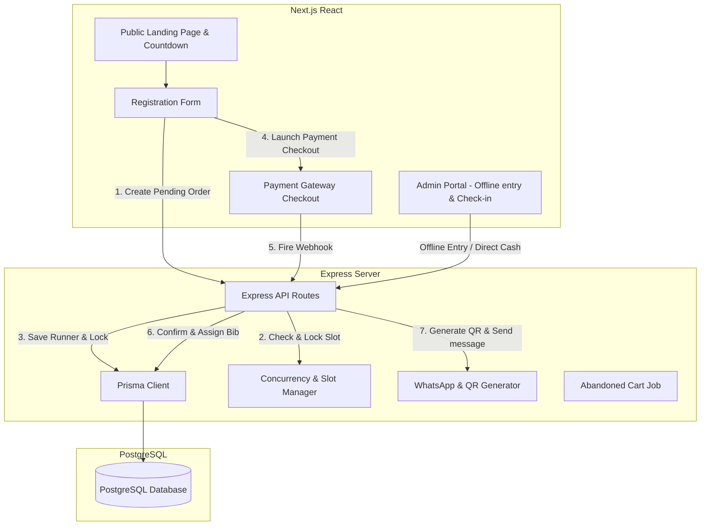

# Marathon Registration System Implementation Plan

This plan details the design, architecture, and step-by-step implementation for the Marathon Registration System. The application consists of a Next.js frontend and a Node.js/Express backend integrated with Prisma ORM and PostgreSQL.

## User Review Required

> [!IMPORTANT]
> **Local Database for Testing**: We will configure Prisma to support PostgreSQL. However, for local development convenience, we can configure Prisma to use SQLite as a fallback or setup PostgreSQL connection strings in `.env`. Please let us know if you have a running PostgreSQL instance you would like to connect to immediately.
>
> **WhatsApp Gateway**: Since Meta Cloud API credentials require a verified Meta Business Manager account, we will implement a fully functioning mock/simulated WhatsApp service that outputs sent messages to a dedicated logs viewer in the Admin Portal, while keeping the API structure ready for direct replacement with Meta Cloud API or Twilio credentials in the `.env` file.

## Open Questions

- Do you have a preferred payment gateway between **Razorpay** and **Stripe**? We can build a simulated payment checkout that demonstrates both or implement a specific integration using standard credentials.
- Would you like the frontend and backend to be separate folders in a monorepo (`/frontend` and `/backend`), or would you prefer a unified Next.js project using Next.js Server Actions and API Routes, which keeps deployment simple? (A monorepo with separate `frontend` and `backend` directories matches the initial blueprint).

---

## Proposed Architecture & Components

---

## Proposed Changes

We will create a monorepo structure with `/frontend` (Next.js) and `/backend` (Express, Prisma, PostgreSQL).

### Database Schema (Prisma)

#### [NEW] [schema.prisma](file:///d:/Thiru%20sir%20projects/Marathon/backend/prisma/schema.prisma)
Defines the database schema:
- **`Category`**: 5K, 10K, Half Marathon, Full Marathon. Includes price, slot capacity, and start time.
- **`Runner`**: Detailed contact info, category, medical details, emergency contact, t-shirt size, payment status (`PENDING`, `CONFIRMED`, `EXPIRED`), registration source (`ONLINE`, `OFFLINE`), payment method, unique bib number, QR code URL, and kit collection status.
- **`SlotLock`**: Tracks temporary slot holds (5 minutes) for runners in the payment funnel.
- **`WhatsAppLog`**: Tracks outgoing messages (simulated/actual) for admin auditing.

---

### Backend (Express API)

#### [NEW] [package.json](file:///d:/Thiru%20sir%20projects/Marathon/backend/package.json)
Node.js dependencies: `express`, `cors`, `@prisma/client`, `dotenv`, `qrcode`, `jsonwebtoken`, `bcryptjs`, `node-cron`.

#### [NEW] [server.js](file:///d:/Thiru%20sir%20projects/Marathon/backend/server.js)
Bootstrap the Express server, middleware, error handlers, and route mounts.

#### [NEW] [slotManager.js](file:///d:/Thiru%20sir%20projects/Marathon/backend/services/slotManager.js)
Handles concurrency and temporary slot locking:
- Atomic checks: ensures slots are available before locking.
- Creates `SlotLock` records with an expiration timestamp.
- Cron job/cleaner to automatically free expired slots.

#### [NEW] [whatsapp.js](file:///d:/Thiru%20sir%20projects/Marathon/backend/services/whatsapp.js)
Generates the unique kit collection QR code using `qrcode` library, and triggers the simulated/actual WhatsApp API template message containing details.

#### [NEW] [registrationController.js](file:///d:/Thiru%20sir%20projects/Marathon/backend/controllers/registrationController.js)
Implements online registration creation, offline entry, checkout completion webhooks, and QR code check-in fulfillment.

---

### Frontend (Next.js & CSS Modules)

#### [NEW] [package.json](file:///d:/Thiru%20sir%20projects/Marathon/frontend/package.json)
Next.js dependencies, lucide-react for modern icons.

#### [NEW] [globals.css](file:///d:/Thiru%20sir%20projects/Marathon/frontend/src/app/globals.css)
Design tokens: Elegant dark mode theme (Deep space black `#0b0f19`, neon purple accent `#8b5cf6`, cyan accents `#06b6d4`, glassmorphism styles, and custom typography).

#### [NEW] [page.tsx](file:///d:/Thiru%20sir%20projects/Marathon/frontend/src/app/page.tsx)
Highly visual landing page featuring a registration countdown timer, event schedule, race categories grid (with slot counts), and attractive parallax design elements.

#### [NEW] [register/page.tsx](file:///d:/Thiru%20sir%20projects/Marathon/frontend/src/app/register/page.tsx)
Step-by-step registration flow:
1. Category selection with real-time remaining slots.
2. Runner details (name, email, phone, gender, t-shirt size).
3. Medical details & emergency contact info.
4. Summary & payment checkout redirect.

#### [NEW] [admin/page.tsx](file:///d:/Thiru%20sir%20projects/Marathon/frontend/src/app/admin/page.tsx)
Volunteers/Admin dashboard featuring:
- **Statistics Overview**: total registrations, revenue, slot usage percentage per category.
- **Offline Registration Desk**: Form to register offline runners with cash/POS/UPI input.
- **Kit Collection Desk**: A quick-scan search/camera mock input for checking in runners and verifying QR codes.
- **WhatsApp Audit Logs**: A simulated panel displaying all triggered WhatsApp messages, QR codes, and delivery statuses.

---

## Verification Plan

### Automated Tests
- Verification of Express route status codes and slot lock releases.
- Validation of Bib number structure parsing.

### Manual Verification
1. Open the landing page and check the countdown timer and slot capacities.
2. Complete an online registration: submit the form, verify that the slot is locked temporarily, finish mock payment, and ensure the status updates to `Confirmed` with a unique Bib number.
3. Open the Admin Panel and complete an offline registration: verify direct confirmation and instant Bib number assignment.
4. Verify the WhatsApp simulated log: check that the template message includes the runner's name, category, structured Bib number, and the kit verification QR code.
5. Search for the runner in the Admin Check-In desk, verify their details, and mark their kit as collected.
